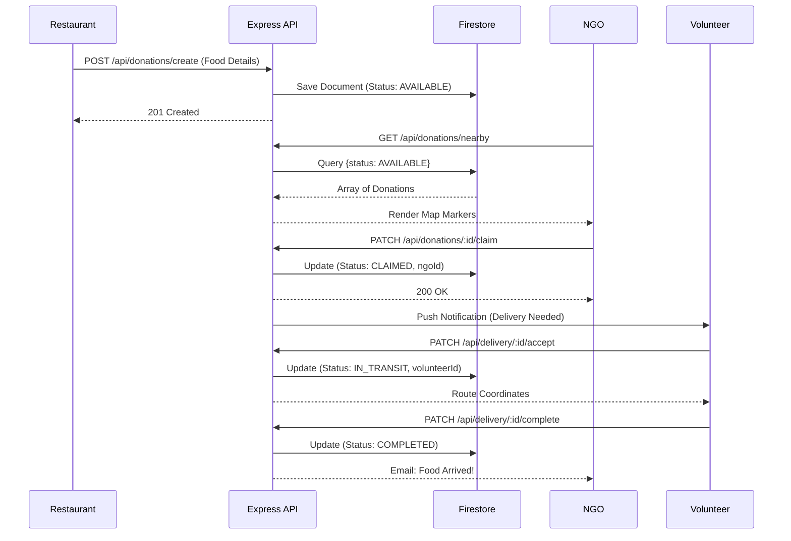
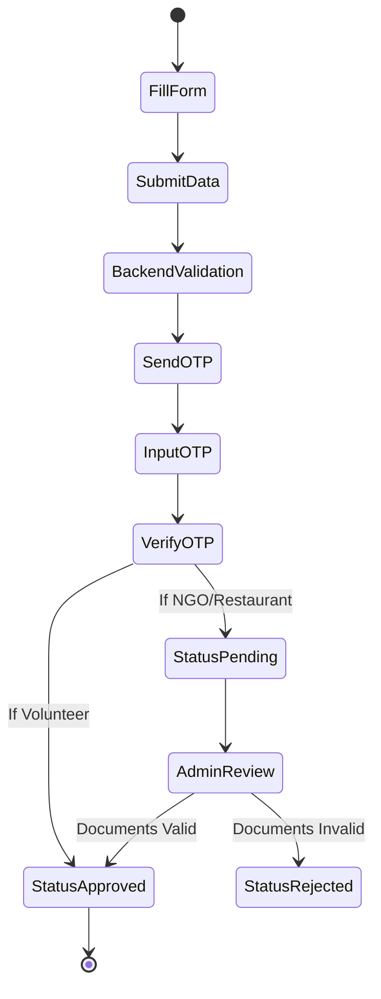
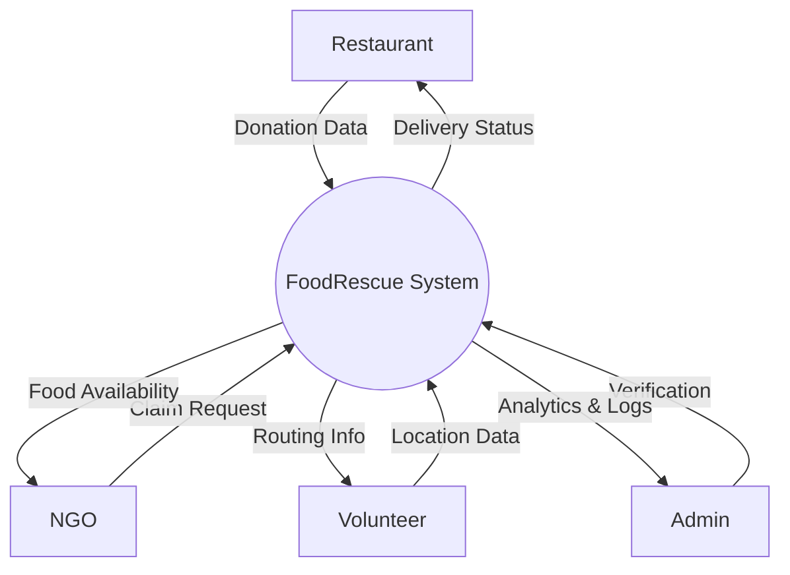
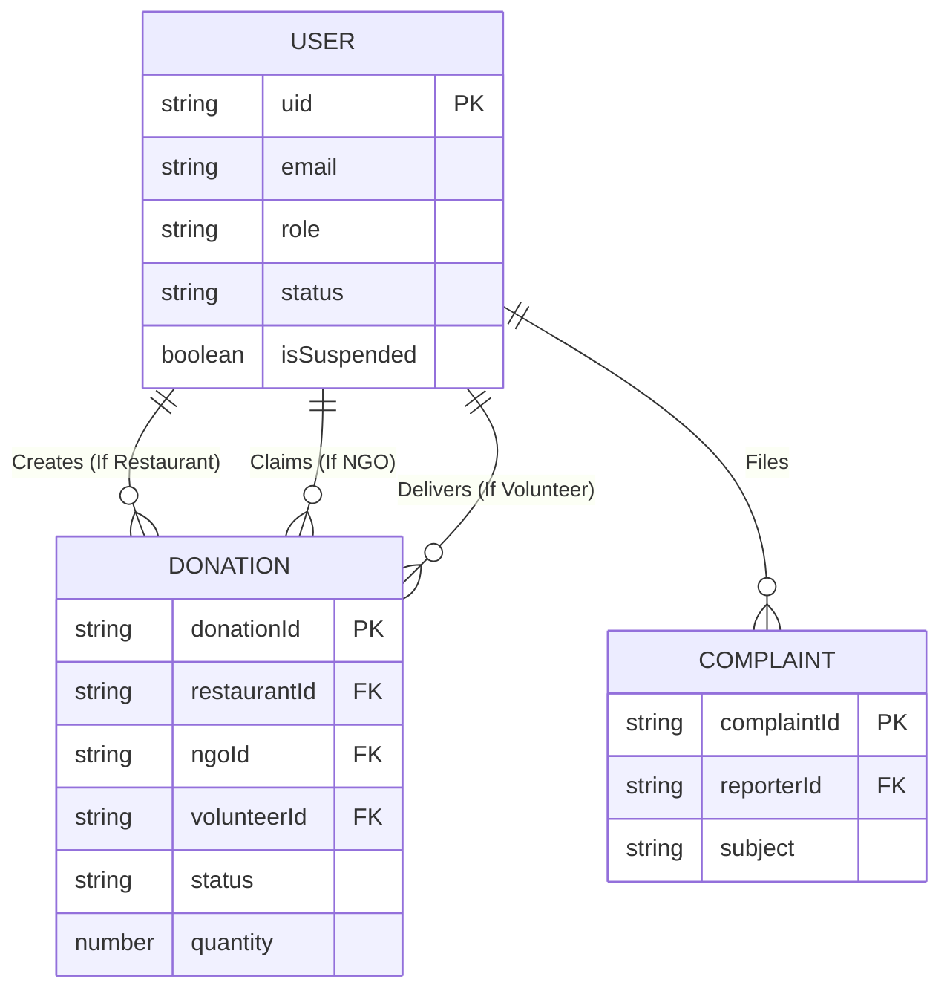
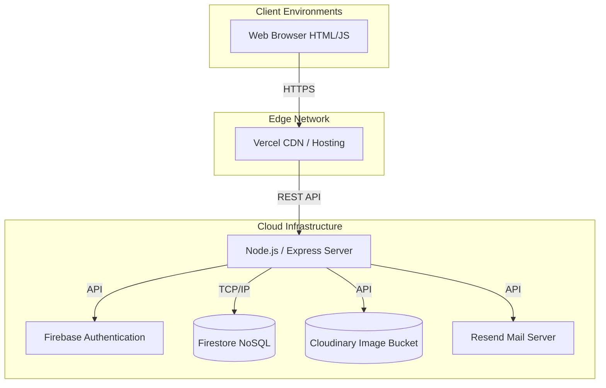

# FRONT MATTER

*(Instructions: Replace bracketed placeholders with actual details before finalizing the document.)*

## COVER PAGE
**Project Title:** Food Distribution System (FoodRescue)  
**Student Name:** [Your Name]  
**College:** [Your College Name]  
**Department:** [Your Department Name]  
**Internship Company:** [Company Name]  
**Guide Name:** [Guide's Name]  
**Academic Year:** [202X-202X]  

## CERTIFICATE
This is to certify that the project entitled **"Food Distribution System (FoodRescue)"** is a bonafide work carried out by **[Your Name]** in partial fulfillment for the award of the degree of [Degree Name] in [Department] at [College Name] during the academic year [202X-202X]. The project report has been approved as it satisfies the academic requirements in respect of project work prescribed for the said degree.

## ACKNOWLEDGEMENT
I would like to express my profound gratitude to my guide, **[Guide's Name]**, for their invaluable support, encouragement, and supervision during the course of this project. I am also deeply thankful to the management of **[Company Name]** for providing the opportunity to undertake this internship. Finally, I extend my heartfelt thanks to my parents and friends for their continuous support and motivation.

---

## ABSTRACT

Food waste and hunger remain paradoxical global crises. While tons of perfectly edible food are discarded daily by restaurants and event organizers, millions of people suffer from malnutrition. The **FoodRescue Distribution System** is a robust, full-stack, real-time web application developed to bridge the gap between food donors and those in need. 

The software leverages a highly scalable architecture utilizing Node.js, Express, and Firebase Firestore to facilitate real-time matching, tracking, and coordination of food donations. It features a stringent Role-Based Access Control (RBAC) system for four distinct entities: Restaurants (Donors), NGOs (Receivers), Volunteers (Logistics), and Administrators (Governance). By integrating intelligent geolocation through OpenRouteService, secure authentication via JWT and Email OTPs, and an immutable audit ledger for fraud detection, FoodRescue digitizes and optimizes the entire donation supply chain. This project report details the end-to-end SDLC (Software Development Life Cycle) of the platform, outlining system architecture, database modeling, security protocols, API workflows, and comprehensive automated testing strategies.

---

## TABLE OF CONTENTS
1. [Chapter 1: Introduction](#chapter-1-introduction)
2. [Chapter 2: Literature Review](#chapter-2-literature-review)
3. [Chapter 3: System Analysis](#chapter-3-system-analysis)
4. [Chapter 4: Project Analysis](#chapter-4-project-analysis)
*(Chapters 5-10 will follow in subsequent parts)*

---

# CHAPTER 1: INTRODUCTION

## 1.1 What is Food Waste
Food waste refers to food that is of good quality and fit for human consumption but is discarded before it is consumed. This occurs at various stages of the food supply chain, including production, processing, retailing, and consumption. In urban settings, restaurants, catering services, and households are the primary contributors to post-consumer food waste.

## 1.2 Global Food Waste Statistics
According to the UNEP Food Waste Index Report (2024), approximately **1.05 billion tonnes** of food goes to waste globally each year, which accounts for nearly 19% of all food available to consumers. 

*(Image Placeholder: [Insert Bar Graph: Global Food Waste by Sector (Household 60%, Food Service 28%, Retail 12%)])*

- **Household Waste:** Accounts for the majority of waste (approx. 631 million tonnes).
- **Restaurant/Food Service Waste:** Contributes roughly 290 million tonnes. Restaurants frequently discard surplus inventory to maintain freshness standards.
- **Supply Chain Loss:** An estimated 13% of the world’s food is lost between harvest and retail.

## 1.3 Food Waste in India
India faces a severe paradox of agricultural abundance paired with immense food waste. According to the FAO, approximately **40% of the food produced in India is wasted** every year, amounting to almost 68 million tonnes. 
- **Economic Loss:** The estimated economic value of this waste exceeds ₹92,000 crores annually.
- **Environmental Impact:** Rotting food in Indian landfills generates immense quantities of methane, a greenhouse gas 25 times more potent than carbon dioxide.

*(Image Placeholder: [Insert Pie Chart: Food Waste Distribution in India by State/Region])*

## 1.4 Why Food Waste is a Problem
1. **Resource Depletion:** Wasting food means wasting the water, land, energy, and labor used to produce it.
2. **Climate Change:** Food waste contributes to 8-10% of global greenhouse gas emissions.
3. **Economic Inefficiency:** Restaurants lose profit margins on discarded inventory.

## 1.5 Hunger Statistics Globally and in India
- **Globally:** The World Food Programme (WFP) estimates that over 783 million people faced chronic hunger in 2023. 
- **In India:** India ranks 111th out of 125 countries in the Global Hunger Index (2023), categorizing its level of hunger as "serious." Over 224 million people in India are considered undernourished.

## 1.6 Relationship Between Food Waste and Hunger
The core issue is not a lack of food production, but a failure of **distribution and logistics**. The surplus food discarded by commercial entities on a single day in a metropolitan city is often enough to feed thousands of local homeless individuals. Bridging this geographical and logistical gap is the primary motivator for technological intervention.

## 1.7 Problem Statement
Current food redistribution efforts face critical bottlenecks:
- **Restaurants** throw away food because they lack a quick, reliable platform to alert charities.
- **NGOs** cannot dynamically locate surplus food in real-time.
- **Volunteers** lack a coordinated tracking system to manage pickups and deliveries efficiently.
- **Administrators** have no way to verify the authenticity of NGOs, leading to food safety concerns and potential fraud.
- **Communication** relies on manual phone calls, causing delays that allow perishable food to spoil.

## 1.8 Need for the Project
A centralized, real-time software platform is required to automate the logistics of food rescue. By digitizing the alert system and providing algorithmic geographic matching, the time taken from "food available" to "food delivered" can be drastically minimized.

## 1.9 Objectives
1. To develop a robust RESTful API backend capable of handling real-time donation states.
2. To implement a secure Role-Based Access Control (RBAC) system for Donors, NGOs, and Volunteers.
3. To integrate geospatial routing for efficient volunteer delivery assignments.
4. To ensure data integrity and prevent fraud through an Immutable Audit Ledger and Admin Verification system.

## 1.10 Scope
The current scope covers web-based operations for urban and semi-urban food redistribution. Future expansions include mobile applications (Android/iOS) for better background GPS tracking, ML-based demand prediction, and IoT integration for temperature monitoring during transit.

---

# CHAPTER 2: LITERATURE REVIEW

Existing food rescue platforms have attempted to solve this issue with varying degrees of success.

| System Name | Key Features | Limitations | How FoodRescue Improves Upon It |
| :--- | :--- | :--- | :--- |
| **Food Rescue US** | Volunteer scheduling | Limited automated tracking | Implements real-time maps and strict Admin verification. |
| **OLIO** | Peer-to-peer sharing | High risk of unsafe food | Restricts donations strictly to verified Commercial Restaurants. |
| **Too Good To Go** | Sells surplus at discount | Does not target extreme poverty | FoodRescue is 100% charitable, connecting directly with verified NGOs. |
| **Feeding India** | Large fleet of vans | High operational overhead | Uses a decentralized gig-economy model for local Volunteers. |

**Summary of Limitations in Existing Systems:** Most platforms lack rigorous security (like JWT-based 2FA and Document Verification for NGOs) or fail to provide a cohesive live-tracking dashboard for all three interacting parties simultaneously.

---

# CHAPTER 3: SYSTEM ANALYSIS

## 3.1 Functional Requirements
- **Authentication:** Multi-step registration with Email OTP verification. Admin approval required for NGOs/Restaurants.
- **Donation Management:** Restaurants must be able to list food (Quantity, Expiry).
- **Claim System:** NGOs must be able to view maps and claim active donations.
- **Logistics:** Volunteers must receive tasks, update delivery status, and mark completion.
- **Mission Control:** Admins must have dashboards to view analytics, ban malicious users, and resolve complaints.

## 3.2 Non-functional Requirements
- **Security:** API endpoints must be protected by Helmet, rate limiting, XSS-clean, and JWTs.
- **Scalability:** The NoSQL structure must support rapid scaling without schema migrations.
- **Performance:** Frontend assets must be delivered swiftly; API responses should average < 200ms.

## 3.3 Hardware Requirements
- **Server:** Cloud Hosting (e.g., Vercel, Render) with at least 1GB RAM for the Node.js runtime.
- **Client:** Any modern device (Desktop/Mobile) with a minimum 3G connection and a standard web browser.

## 3.4 Software Requirements
- **Backend:** Node.js (v18+), Express.js.
- **Database:** Firebase Firestore, Firebase Admin SDK.
- **Frontend:** HTML5, CSS3 (Tailwind CSS), Vanilla ES6 JavaScript.

## 3.5 Feasibility Study
- **Technical Feasibility:** The architecture utilizes well-documented, enterprise-grade tools (Firebase, Node). Feasible.
- **Economic Feasibility:** Leveraging free-tier cloud services (Vercel, Cloudinary, Firebase) minimizes initial capital expenditure. Feasible.
- **Operational Feasibility:** The UI is designed to be intuitive for non-technical restaurant staff and volunteers. Feasible.

---

# CHAPTER 4: PROJECT ANALYSIS

## 4.1 Overall Workflow
The system orchestrates three distinct roles monitored by an Admin. A Restaurant creates a donation payload. The system broadcasts this to the map. An NGO claims the food. A Volunteer within a specific radius accepts the pickup request. The Volunteer picks up the food from the Restaurant and delivers it to the NGO. The Admin monitors the entire lifecycle via the Mission Control Dashboard.

## 4.2 Application Modules (Extracted from Source Code)
Based on the `src/modules` directory in the source code:
1. **Auth Module:** Manages registration, JWT issuance, OTP, and 2FA.
2. **Donation Module:** CRUD operations for food lifecycle.
3. **Delivery Module:** Handles volunteer assignments and geographic distance calculations.
4. **Admin Module:** User suspension, document verification, and ledger auditing.
5. **Analytics Module:** Aggregates metrics (Meals Served, CO2 Saved).
6. **Notification Module:** Dispatches in-app alerts and Resend/Nodemailer emails.

## 4.3 Unified Modeling Language (UML) & Architectural Diagrams

*(Note: The following diagrams are rendered using Mermaid.js syntax, accurately reflecting the source code's business logic.)*

### 4.3.1 Use Case Diagram
```mermaid
usecaseDiagram
    actor Restaurant
    actor NGO
    actor Volunteer
    actor Admin

    Restaurant --> (Create Donation)
    Restaurant --> (View Dashboard)
    
    NGO --> (View Map)
    NGO --> (Claim Donation)
    
    Volunteer --> (Accept Delivery)
    Volunteer --> (Update Live Location)
    
    Admin --> (Verify Legal Documents)
    Admin --> (Ban/Suspend Users)
    Admin --> (View Fraud Analytics)
    
    (Create Donation) .> (Login) : include
    (Claim Donation) .> (Login) : include
```

### 4.3.2 Sequence Diagram: Food Donation Lifecycle


### 4.3.3 Activity Diagram: Registration & Verification


### 4.3.4 Data Flow Diagram (DFD) Level 0 (Context Diagram)


### 4.3.5 Entity Relationship (ER) Diagram Concept
*(Derived from Firebase NoSQL structure)*


### 4.3.6 Deployment Diagram


---
*End of Part 1. (Chapters 5 through 10 to follow)*
